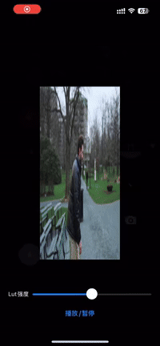
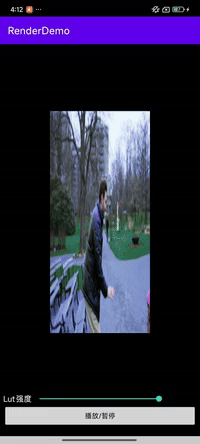

# RenderDemo

基于 Swift + OpenGL ES 的 iOS 渲染演示项目

## 功能特性

### 第一阶段: 学会双端开发，实现UI控制渲染Demo。
- [x] 1. 用Xcode创建Demo，用OpenGL在屏幕上渲染想要的东西。
- [x] 2. 将图片渲染到屏幕上。
- [x] 3. 渲染序列帧，不断循环切换纹理展现效果。
- [x] 4. IOS    ：学会写Swift ，添加简单自定义界面和控件、布局、按钮事件等。
- [x] 5. Android：学会写Kotlin，功能同4。

### 第二阶段: 熟悉库的引入，学会封装一个双端库。
- [x] 1. 了解CocoaPods，引入三方库实现功能。
- [x] 2. 封装上Demo为双端库，编译出framework、静态库，拉到Demo工程进行联调。

### 第三阶段: 帮助完成类型相关C++代码修改工作，之后并一定程度上熟悉渲染框架。
- [x] 1. 类型数据序列化与反序列化。
- 

### 第四阶段: 服务业务目标。（加分项）
- 

## 运行要求
- Xcode 15+ (iOS SDK)
- 支持 OpenGL ES 3.0 的 iOS 设备（iPhone 5s 及以上）

## 快速开始
1. 克隆仓库：
   git clone https://github.com/1457128555/RenderDemo.git

2. 打开工程：
    open RenderDemo.xcodeproj

3. 连接设备后运行（Command+R）

# 🎥 渲染效果演示

<table>
  <tr>
    <td align="center">
      <b>iOS 演示</b> 
      
    </td>
    <td align="center">
      <b>Android 演示</b> 
      
    </td>
  </tr>
</table>